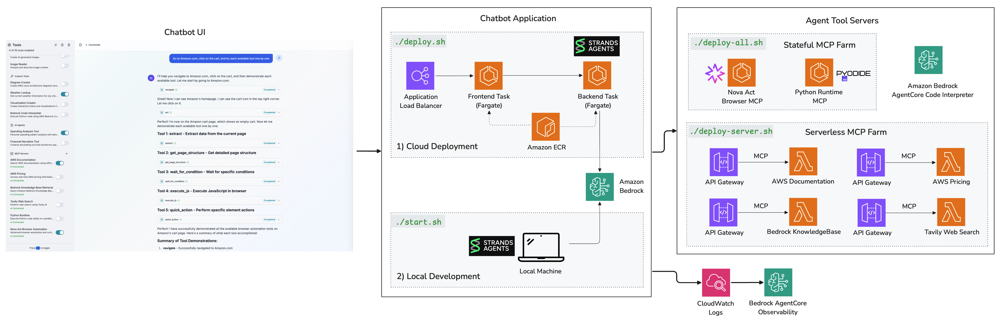
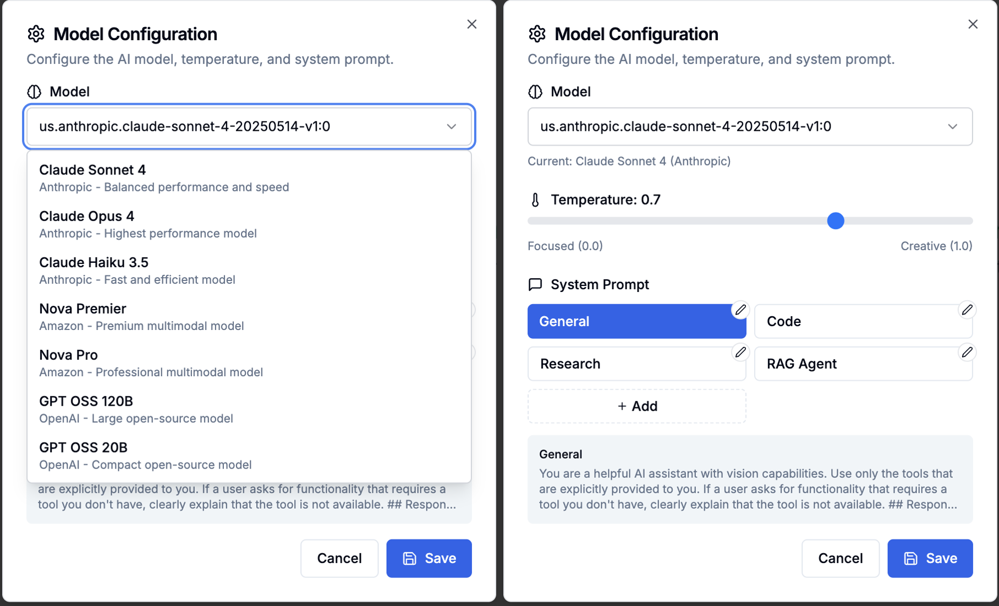
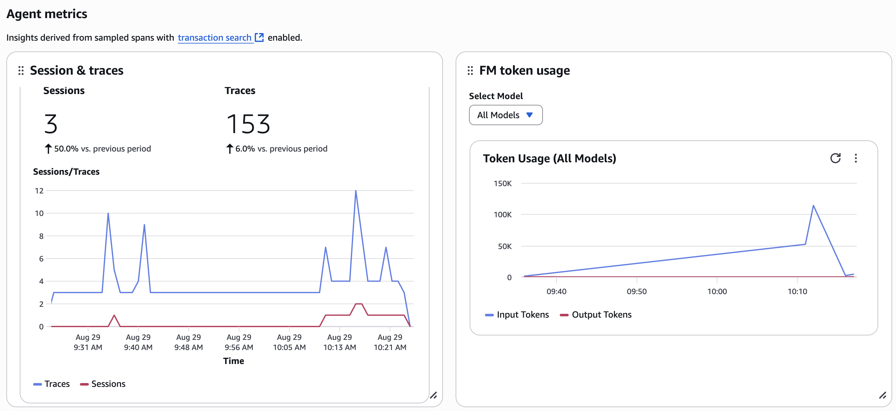

# Sample Strands Agent Chatbot

A comprehensive AI agent testing platform built with Strands Agents framework, designed for rapid prototyping and testing of business-specific AI tools. This platform enables plug-and-play integration of Built-in tools, Custom tools, MCP servers, and Agents with easy toggle functionality.

## Overview

This demo platform serves as a testing ground for AI agents tailored to specific business requirements. It provides a flexible environment where you can:

- **Define and integrate custom tools** based on your business needs
- **Toggle tools on/off** with a simple UI interface
- **Test different tool combinations** to find optimal configurations
- **Deploy locally or to the cloud** with minimal configuration
- **Leverage pre-built MCP servers** deployable to AWS Lambda

## Key Features


- **AI-Powered Chat**: Built on AWS Bedrock with Claude Sonnet 4
- **Real-time Streaming**: Server-Sent Events for live responses
- **Plug & Play Tools**: Easy integration of Built-in, Custom, MCP tools, and Agents
- **Toggle Interface**: Visual tool management with on/off switches
- **File Upload Support**: Text, image, PDF, and various file format processing
- **Analysis Dashboard**: Real-time tool execution monitoring
- **MCP Connection Status**: Real-time monitoring of MCP server connectivity
- **Dual Deployment**: Local development and cloud deployment options
- **Quick Setup**: One-command deployment for both environments
- **Session Management**: Automatic session isolation with fresh start on refresh
- **AgentCore Observability**: Full trace and log monitoring with AWS CloudWatch integration

## Architecture

The platform supports both local development and cloud deployment with a comprehensive MCP ecosystem:



### 1) Cloud Deployment
- **Frontend & Backend**: Deployed as containerized tasks on AWS Fargate
- **Application Load Balancer**: Traffic distribution across containers
- **Amazon ECR**: Docker container registry
- **AI Engine**: Amazon Bedrock for LLM capabilities with AgentCore Code Interpreter
- **IAM Authentication**: Secure access control
- **Serverless MCP Farm**: Lambda-based MCP servers for scalable tool execution
- **Stateful MCP Farm**: ECS-hosted MCP servers for persistent operations

### 2) Local Development
- **Local Machine**: Direct connection to Strands Agents
- **Development Server**: Local FastAPI backend with Next.js frontend
- **Cloud Integration**: Connects to Amazon Bedrock and both MCP farms

### MCP Server Architecture
The platform includes two types of MCP server deployments:

#### Serverless MCP Farm (AWS Lambda)
- **AWS Documentation**: Official AWS service documentation
- **AWS Pricing**: Real-time pricing information
- **Bedrock Knowledge Base**: Enterprise knowledge retrieval
- **Tavily Web Search**: Web search capabilities

#### Stateful MCP Farm (AWS ECS)
- **Nova Act Browser**: Advanced browser automation with natural language control and Playwright API integration
- **Python Runtime**: Sandboxed Python code execution using Pyodide

## Tool Management System

The platform supports four distinct types of tools, each with plug-and-play capabilities:

### Built-in Tools
Core Strands framework tools that provide essential functionality:
- **Calculator**: Mathematical operations and computations
- **HTTP Request**: API calls and web data fetching
- **Image Generator**: AI-powered image creation
- **Image Reader**: Image analysis and description

### Custom Tools
Business-specific tools tailored to your requirements:
- **Diagram Creator**: Create AWS cloud architecture diagrams and UML diagrams with server-optimized rendering
- **Weather Lookup**: Get current weather information for any city worldwide
- **Visualization Creator**: Create interactive charts and visualizations from data
- **Bedrock Code Interpreter**: Execute Python code using AWS Bedrock Code Interpreter with automatic file download support

### MCP Servers
Modular Context Protocol servers providing external integrations:

#### Serverless MCP Servers (Lambda)
- **AWS Documentation**: Search AWS documentation using official Search API
- **AWS Pricing**: Access real-time AWS pricing information and analyze cost
- **Bedrock Knowledge Base Retrieval**: Query Amazon Bedrock Knowledge Bases using natural language
- **Tavily Web Search**: Perform web search using Tavily AI


#### Stateful MCP Servers (ECS)
- **Nova Act Browser**: Advanced browser automation combining natural language instructions with direct Playwright API access. Supports high-level actions like "click the blue submit button" alongside precise element targeting with CSS selectors


- **Python Runtime**: Execute Python code safely in a sandboxed environment using Pyodide

### Agents (Sub-Agents)
Specialized AI agents for complex workflows:
- **Spending Analysis Tool**: Personal spending pattern analysis with demographic comparisons and behavioral insights
- **Financial Narrative Tool**: Creative storytelling tool that transforms spending data into narratives with AI-generated images


### Adding MCP Servers

You can easily add new MCP servers through the intuitive interface:

1. **Name**: Provide a descriptive name for your MCP server
2. **Description**: Brief description of what the server provides
3. **Category**: Organize servers by category (general, finance, etc.)
4. **Server URL**: The endpoint URL (should end with `/mcp` for Streamable HTTP protocol). Supports AWS Parameter Store references using `ssm://parameter-name` format
5. **Connection Status**: Real-time monitoring shows connection status:
   - **Connected**: Server is responding and accessible
   - **Disconnected**: Server is unreachable or returning errors
   - **Invalid URL**: URL format is incorrect or placeholder
   - **Unknown**: Connection status not yet determined

### Model Configuration

Configure AI models, temperature, and system prompts:



**Model Selection**: Choose from various AI models including Claude Sonnet 4
**Temperature Control**: Adjust creativity vs. focus (0.0 = Focused, 1.0 = Creative)
**System Prompts**: Customize behavior with predefined prompt templates:
- **General**: Default helpful AI assistant behavior
- **Code**: Specialized for programming and technical tasks
- **Research**: Optimized for research and analysis tasks
- **RAG Agent**: Configured for retrieval-augmented generation

### Main Chat Interface
- Real-time streaming responses with typing indicators
- File upload support (text, images, PDFs, and various formats)
- Tool execution visualization with status indicators
- Analysis panel for complex operations
- Conversation history and export capabilities

### Tool Management Panel
- Visual toggle switches for each tool category
- Real-time tool status indicators
- Tool configuration options
- MCP server connection management
- Performance metrics and usage statistics

## Quick Start

### Prerequisites

- Python 3.8+
- Node.js 18+
- Docker & Docker Compose
- AWS credentials (for Bedrock access)

### Local Deployment

1. **Clone and setup**:
   ```bash
   git clone https://github.com/aws-samples/sample-strands-agent-chatbot.git
   cd sample-strands-agent-chatbot
   chmod +x start.sh
   ```

2. **Configure environment**:
   ```bash
   cp .env.example .env.development
   # Edit .env.development with your AWS credentials
   ```

3. **Start the application**:
   ```bash
   ./start.sh
   ```

4. **Access the application**:
   - Frontend: http://localhost:3000
   - Backend API: http://localhost:8000
   - API Docs: http://localhost:8000/docs

### Cloud Deployment

For detailed deployment instructions, see [DEPLOYMENT.md](DEPLOYMENT.md).

Quick start:
```bash
# 1. Deploy main application
cd agent-blueprint/chatbot-deployment/infrastructure
./scripts/deploy.sh

# 2. Deploy MCP servers
cd ../../serverless-mcp-farm
./deploy-server.sh
```

## Technology Stack

### Backend
- **Framework**: FastAPI (Python 3.8+)
- **AI Engine**: Strands Agents (v1.2.0) with AWS Bedrock
- **Real-time**: Server-Sent Events (SSE) with session isolation
- **HTTP Client**: aiohttp for MCP server connectivity checks
- **Storage**: In-memory session management with local filesystem
- **Containerization**: Docker

### Frontend
- **Framework**: Next.js 15 (React 18)
- **Language**: TypeScript
- **Styling**: Tailwind CSS + shadcn/ui components
- **State Management**: React Hooks with session storage
- **Real-time**: EventSource API for SSE connections
- **File Processing**: Multi-file upload with document support

### Infrastructure
- **Local**: Docker Compose with hot reload
- **Cloud**: AWS (ECS Fargate, ALB, S3)
- **MCP Servers**: AWS Lambda with Streamable HTTP transport
- **Deployment**: AWS CDK with automated infrastructure setup

## Configuration

### Tool Configuration
Edit `chatbot-app/backend/unified_tools_config.json`:
```json
{
  "strands_tools": [
    {
      "id": "calculator",
      "name": "Calculator",
      "enabled": true,
      "category": "utilities",
      "description": "Perform mathematical calculations"
    }
  ],
  "custom_tools": [
    {
      "id": "spending_analysis_tool",
      "name": "Spending Analysis Tool",
      "enabled": true,
      "category": "finance",
      "description": "Personal spending pattern analysis with data visualization"
    }
  ],
  "mcp_servers": [
    {
      "id": "aws_docs",
      "name": "AWS Documentation",
      "enabled": false,
      "transport": "streamable_http",
      "url": "https://your-lambda-url.amazonaws.com/mcp",
      "category": "documentation"
    }
  ],
  "agents": [
    {
      "id": "spending_analysis_agent",
      "name": "Spending Analysis Agent",
      "enabled": true,
      "category": "finance",
      "description": "Personal spending pattern analysis with demographic comparisons"
    },
    {
      "id": "financial_narrative_agent", 
      "name": "Financial Narrative Agent",
      "enabled": true,
      "category": "finance",
      "description": "Creative storytelling tool that transforms spending data into humorous narratives"
    }
  ]
}
```

### Environment Configuration
- `.env.development`: Local development settings
- `.env.production`: Cloud deployment settings
- `.env.example`: Template with all available options

## Pre-built MCP Servers

The platform includes ready-to-deploy Lambda MCP servers with Streamable HTTP transport:

### AWS Documentation Server
- **Purpose**: Retrieve AWS service documentation
- **Deployment**: `agent-blueprint/direct-lambda-mcp/aws-documentation/`
- **Usage**: Ask questions about AWS services and best practices
- **Origin**: https://github.com/awslabs/mcp/tree/main/src/aws-documentation-mcp-server

### AWS Pricing Server
- **Purpose**: Get real-time AWS pricing information
- **Deployment**: `agent-blueprint/direct-lambda-mcp/aws-pricing/`
- **Usage**: Compare costs across AWS services and regions
- **Origin**: https://github.com/awslabs/mcp/tree/main/src/aws-pricing-mcp-server

### Bedrock KB Retrieval Server
- **Purpose**: Search enterprise knowledge bases
- **Deployment**: `agent-blueprint/direct-lambda-mcp/bedrock-kb-retrieval/`
- **Usage**: Enterprise knowledge retrieval and Q&A
- **Origin**: https://github.com/awslabs/mcp/tree/main/src/bedrock-kb-retrieval-mcp-server

### Tavily Web Search Server
- **Purpose**: Web search capabilities with AI-powered results
- **Deployment**: `agent-blueprint/direct-lambda-mcp/tavily-web-search/`
- **Usage**: Real-time web information and research

### Nova Act Browser Server
- **Purpose**: Hybrid browser automation with natural language control and Playwright API access
- **Deployment**: `agent-blueprint/fargate-mcp-farm/nova-act-mcp/`
- **Usage**: Natural language browser interactions ("click the login button") and precise API control (CSS selectors, JavaScript execution)
- **Features**:
  - High-level natural language actions (navigate, act, extract)
  - Low-level Playwright API tools (get_page_structure, quick_action, execute_js, wait_for_condition)
  - Session management with headless/headed mode support
  - Screenshot capture and page analysis
- **API Key**: Requires Nova Act API key configuration via AWS Parameter Store or .env.local

### Python Runtime Server
- **Purpose**: Safe Python code execution in sandboxed environment
- **Deployment**: `agent-blueprint/stateful-mcp/python-mcp/`
- **Usage**: Data analysis, computations, and Python script execution
- **Origin**: https://github.com/pydantic/pydantic-ai/tree/main/mcp-run-python

## Deployment Options

### Local Development
```bash
./start.sh
```

### AWS Cloud Deployment
```bash
# See DEPLOYMENT.md for complete instructions
# 1. Deploy main application (creates VPC)
cd agent-blueprint/chatbot-deployment/infrastructure
./scripts/deploy.sh

# 2. Deploy serverless MCP servers (independent)
cd ../../serverless-mcp-farm
./deploy-server.sh

# 3. Deploy shared infrastructure (uses VPC)
cd ../fargate-mcp-farm/shared-infrastructure
./deploy.sh

# 4. Deploy stateful MCP servers (uses VPC + shared ALB)
cd ../
./deploy-all.sh -s nova-act-mcp
```

See `DEPLOYMENT.md` for detailed AWS deployment instructions using CDK.


### Adding New Tools
1. **Built-in Tools**: Extend Strands framework capabilities
2. **Custom Tools**: Create business-specific functionality
3. **MCP Servers**: Develop external service integrations
4. **Agents**: Build specialized AI workflows

## 🔍 AgentCore Observability Setup

This application includes full AgentCore observability integration with AWS CloudWatch for comprehensive trace and log monitoring.



### Prerequisites
- AWS CLI installed and configured
- AWS credentials with appropriate permissions (see below)
- CloudWatch Transaction Search enabled

### Required AWS Permissions
Your AWS role/user needs these permissions:
```json
{
  "Version": "2012-10-17",
  "Statement": [
    {
      "Effect": "Allow",
      "Action": [
        "logs:CreateLogGroup",
        "logs:CreateLogStream", 
        "logs:PutLogEvents",
        "logs:DescribeLogGroups",
        "logs:DescribeLogStreams"
      ],
      "Resource": "arn:aws:logs:*:*:log-group:agents/*"
    },
    {
      "Effect": "Allow",
      "Action": [
        "cloudwatch:PutMetricData"
      ],
      "Resource": "*"
    }
  ]
}
```

### Quick Setup
1. **Run the observability setup script:**
   ```bash
   chmod +x setup-observability.sh
   ./setup-observability.sh
   ```
   This will:
   - Create CloudWatch log groups and streams
   - Generate the `.env` file with OTEL configuration
   - Provide next steps for enabling Transaction Search

2. **Enable CloudWatch Transaction Search:**
   - Open [CloudWatch Console](https://console.aws.amazon.com/cloudwatch/)
   - Navigate to **Application Signals (APM)** → **Transaction search**
   - Choose **Enable Transaction Search**
   - Select **ingest spans as structured logs**
   - Choose **Save**

3. **Start the application:**
   ```bash
   cd chatbot-app && ./start.sh
   ```

### Viewing Traces
After setup, you can monitor your agent interactions in:

- **CloudWatch Application Signals**: Traces and performance metrics
- **CloudWatch GenAI Observability Dashboard**: Dedicated AgentCore monitoring  
- **CloudWatch Logs**: Detailed log streams with structured data
- **Session-based filtering**: Use `session.id` to track individual conversations

### What Gets Tracked
- **HTTP Requests**: All API calls and streaming endpoints
- **Bedrock Calls**: LLM inference requests and responses
- **Tool Executions**: Individual tool calls with inputs/outputs
- **Session Context**: Conversation-level trace grouping
- **Error Tracking**: Failed operations and exceptions

### Features Implemented
✅ **Session ID Context Propagation**: Each conversation appears as a unified trace  
✅ **Tool Execution Spans**: All tool calls are instrumented with `execute_tool.*` spans  
✅ **Auto-instrumentation**: FastAPI, Bedrock, and HTTP calls automatically traced  
✅ **Real-time Monitoring**: Ultra-fast batch processing for immediate trace visibility  

## License

MIT License - see LICENSE file for details.

## Support

For issues and questions:
- Check the troubleshooting section in DEPLOYMENT.md
- Ensure all prerequisites are installed
- Verify AWS credentials and permissions
- Test MCP server connectivity

